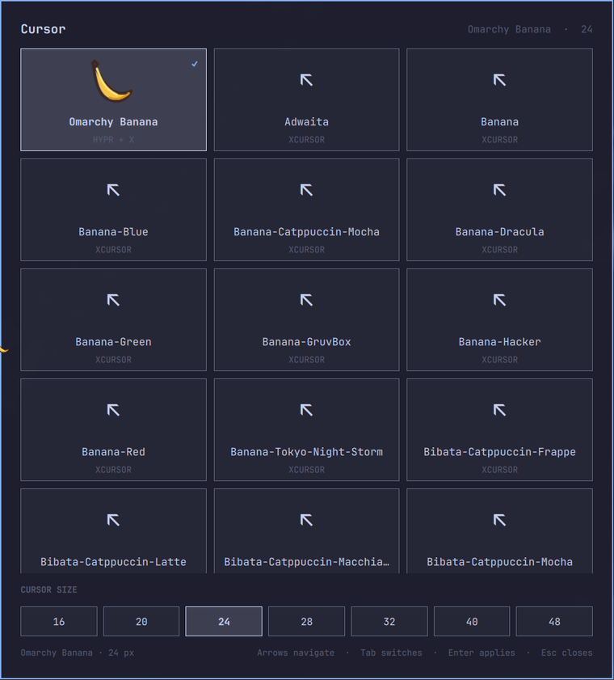
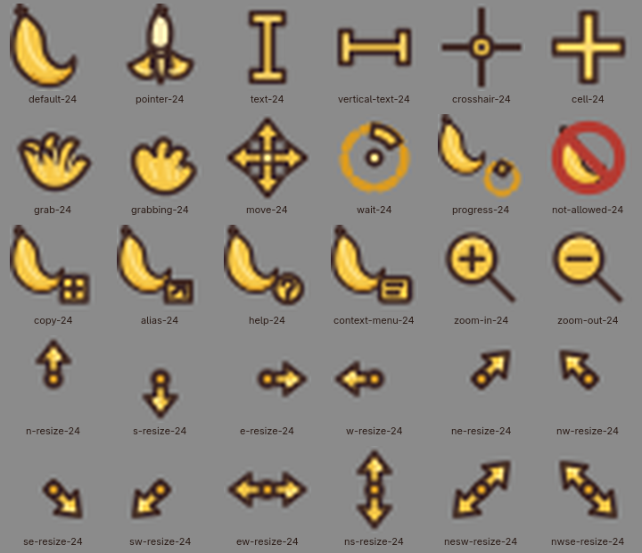

# Omarchy Cursor Switcher

A native Omarchy Quattro / `omarchy-shell` panel for discovering, previewing, applying, and persisting Linux cursor themes in Hyprland. It supports native Hyprcursor themes, legacy XCursor themes with automatic on-the-fly Hyprcursor conversion, discrete cursor sizes, keyboard navigation, safe hover previews, and a bundled cursor family: **Banana** by [ful1e5](https://github.com/ful1e5/banana-cursor).



## Features

- Discovers real cursor themes in `~/.local/share/icons`, `~/.icons`, and `XDG_DATA_DIRS/icons` (normally `/usr/share/icons`).
- **Live switching for all themes:** Native Hyprcursor themes apply directly via `hyprctl setcursor`. Legacy XCursor-only themes (such as Adwaita, Yaru, Bibata, etc.) are automatically and transparently converted to Hyprcursor packages on-the-fly and cached locally under `~/.local/share/icons/CursorSwitcher-XCursor-<name>-<hash>`.
- Uses `hyprctl setcursor` for instant compositor cursor changes and `gsettings` for GTK/XCursor compatibility.
- Updates the systemd/D-Bus activation environment and Quattro's live Hyprland Lua environment for newly launched applications.
- Persists the selection in `~/.config/omarchy/cursor-switcher.json` and UWSM-owned environment fragments (`~/.config/uwsm/env.d/90-omarchy-cursor-switcher` and `~/.config/uwsm/env-hyprland.d/90-omarchy-cursor-switcher`).
- Strict commit/preview transactions: the UI checkmark only moves after backend cursor application is verified successful.
- Debounced live hover previews with clean restoration when hover ends or Escape is pressed.
- Idempotent application launcher integration (`omarchy-cursor-switcher.desktop`, launcher wrapper, SVG icon).
- Installs the bundled Banana theme idempotently at `~/.local/share/icons/Banana` without sudo.
- Has no polling loop and does not scan cursor directories continuously.

## Install

This repository is already usable as a local plugin. From its root:

```bash
ln -s "$PWD" ~/.config/omarchy/plugins/sanjyay.cursor-switcher
omarchy-shell shell rescanPlugins
omarchy plugin enable sanjyay.cursor-switcher
```

For a normal published Git checkout, Omarchy's standard `omarchy plugin add <git-url> --enable` flow may be used instead. No install hook or sudo command is required. The service installs/updates the bundled cursor package on first load.

Open or toggle the selector:

```bash
omarchy-shell shell toggle sanjyay.cursor-switcher '{}'
```

A Hyprland shortcut can run that exact command. The panel also supports `summon` and `hide`:

```bash
omarchy-shell shell summon sanjyay.cursor-switcher '{}'
omarchy-shell shell hide sanjyay.cursor-switcher
```

Arrow keys (or `h/j/k/l`) navigate, Tab switches between the theme grid and size row, Enter/Space commits, `r` refreshes, and Escape cancels any preview and closes the panel.

## Application launcher entry

When installed, Cursor Switcher automatically registers an application desktop entry (`omarchy-cursor-switcher.desktop`), executable launcher (`omarchy-cursor-switcher`), and SVG application icon.

Users can open the panel directly from the Omarchy application launcher by searching:

- `Cursor` / `Cursor Switcher`
- `Pointer`
- `Mouse`
- `Theme`
- `Banana`

The desktop entry invokes `omarchy-cursor-switcher`, which sends an IPC `summon` call to `omarchy-shell` to reveal/open the existing panel without launching a redundant process or toggling it closed if already open.

## Applying Banana manually

Through the loaded plugin service:

```bash
omarchy-shell shell call sanjyay.cursor-switcher applyTheme '{"theme":"Banana","size":24}'
```

Or directly through the backend helper:

```bash
~/.config/omarchy/plugins/sanjyay.cursor-switcher/scripts/cursorctl apply \
  --hyprcursor Banana --xcursor Banana --size 24 --commit
```

## Hyprcursor and XCursor behavior

Hyprland 0.37 and newer accepts only Hyprcursor packages through `hyprctl setcursor`. GTK and some other clients still use XCursor.

For combined packages (such as bundled Banana), both paths are applied immediately.
For legacy XCursor-only packages, the backend extracts and compiles a matching Hyprcursor package on first use, stores it in `~/.local/share/icons/CursorSwitcher-XCursor-<name>-<hash>`, and loads it live into Hyprland while setting XCursor/GTK to the original theme name.

Many applications cache their cursor theme. New applications inherit the updated session environment; existing GTK, Qt, Chromium, or Electron processes may need to be restarted. The plugin writes:

- `~/.config/uwsm/env.d/90-omarchy-cursor-switcher`
- `~/.config/uwsm/env-hyprland.d/90-omarchy-cursor-switcher`

UWSM sources these fragments at the next graphical login. It also updates the current systemd/D-Bus activation environment and the Quattro Lua environment immediately.

## Bundled cursor themes

Cursor Switcher serves as a native integration and selector layer for Hyprland and Linux desktop environments. The plugin bundles curated cursor families from independent open-source projects. Each cursor theme is distributed as an independent data component and retains its original license, copyright notices, and corresponding source material.

Cursor Switcher does not claim ownership, original authorship, or endorsement of any third-party designs.

| Theme | Upstream Project | Author / Creator | License | Local Directory |
| :--- | :--- | :--- | :--- | :--- |
| **Banana** | [ful1e5/banana-cursor](https://github.com/ful1e5/banana-cursor) | Abdulkaiz Khatri (`ful1e5`) | GPL-3.0 | [`themes/banana/`](themes/banana/) |
| **Phinger** | [phisch/phinger-cursors](https://github.com/phisch/phinger-cursors) | Philipp Schaffrath (`phisch`) | CC BY-SA 4.0 | [`themes/phinger/`](themes/phinger/) |
| **Oreo** | [varlesh/oreo-cursors](https://github.com/varlesh/oreo-cursors) | Alexey Varfolomeev (`varlesh`) | GPL-2.0 | [`themes/oreo/`](themes/oreo/) |
| **Volantes** | [varlesh/volantes-cursors](https://github.com/varlesh/volantes-cursors) | Alexey Varfolomeev (`varlesh`) | GPL-2.0 | [`themes/volantes/`](themes/volantes/) |
| **Nordzy** | [guillaumeboehm/Nordzy-cursors](https://github.com/guillaumeboehm/Nordzy-cursors) | Guillaume Boehm (`gboehm`) | GPL-3.0 | [`themes/nordzy/`](themes/nordzy/) |
| **Capitaine** | [keeferrourke/capitaine-cursors](https://github.com/keeferrourke/capitaine-cursors) | Keefer Rourke (`keeferrourke`) | LGPL-3.0 | [`themes/capitaine/`](themes/capitaine/) |

See [`THIRD_PARTY.md`](THIRD_PARTY.md) for full licensing architecture, audit records, and upstream commit provenance.

## Banana Cursor



Banana contains 45 canonical roles and all standard Linux aliases: default/arrow, pointing hand (peeled banana), text, crosshair, cell, open hand / closed hand, move, wait, progress, not-allowed, copy, alias, help, context menu, zoom controls, and cardinal/diagonal resize directions.

The default pointer is an intact banana (`left_ptr`) with hotspot `(5, 5)` at 24 px.
The clickable/pointer role is the peeled banana (`hand2`) with hotspot `(4, 4)` at 24 px.

## Building the assets

Prebuilt Hyprcursor and XCursor output ships in `themes/banana/generated/Banana`, so runtime selection needs no compiler.

Contributor build dependencies (Arch package names) are:

```text
python gcc pkgconf librsvg hyprcursor libxcursor libpng xcur2png
```

Rebuild deterministically with:

```bash
./scripts/build-banana-theme
```

## Development and tests

Run the test suite with:

```bash
./tests/run.sh
```

Coverage includes cursor directory/format detection, normalization and deduplication, persistence round trips and corrupt input, missing-theme fallback, command argv construction, preview/cancel/commit transitions, supported sizes, automated XCursor-to-Hyprcursor conversion and caching, installer idempotence and collision refusal, unsafe inputs, UWSM persistence, SVG/XML constraints, every generated role and alias, intact-versus-peeled role mappings, XCursor alias decoding/hotspots, direct `libhyprcursor` alias loading/hotspots, and `qmllint` against the installed Omarchy shell imports.

## Removal

Disable/remove the plugin with Omarchy's normal command, or remove the local development symlink:

```bash
omarchy plugin disable sanjyay.cursor-switcher
rm ~/.config/omarchy/plugins/sanjyay.cursor-switcher
```

To clean up the application launcher entries:

```bash
~/.config/omarchy/plugins/sanjyay.cursor-switcher/scripts/cursorctl unregister-app
```

Or remove only these plugin-owned paths manually:

```text
~/.local/bin/omarchy-cursor-switcher
~/.local/share/applications/omarchy-cursor-switcher.desktop
~/.local/share/icons/hicolor/scalable/apps/omarchy-cursor-switcher.svg
~/.local/share/icons/Banana
~/.config/omarchy/cursor-switcher.json
~/.config/uwsm/env.d/90-omarchy-cursor-switcher
~/.config/uwsm/env-hyprland.d/90-omarchy-cursor-switcher
```
